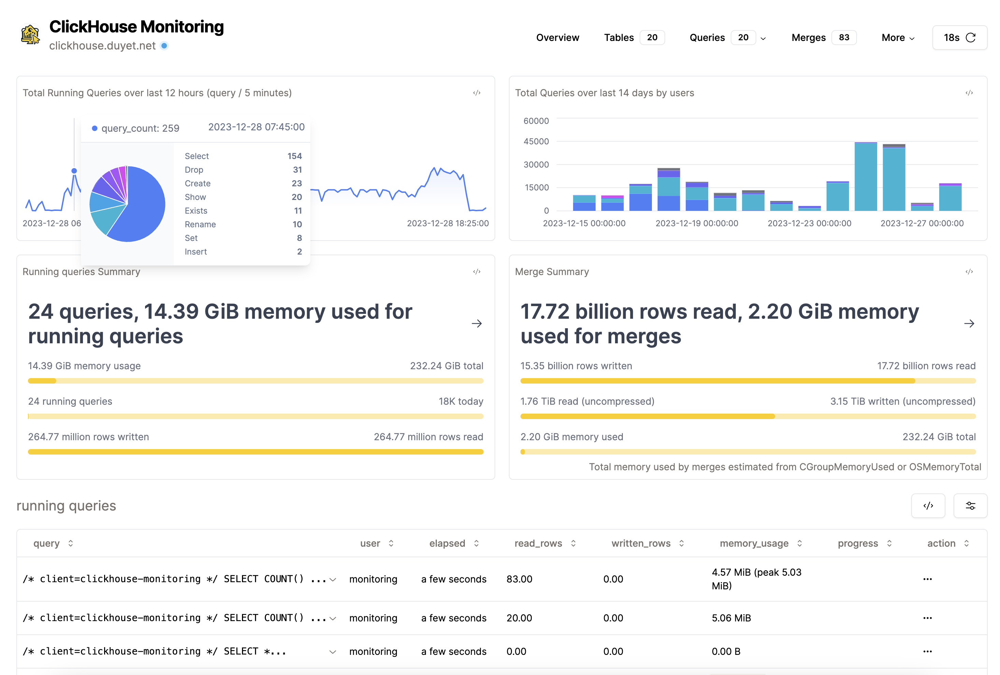
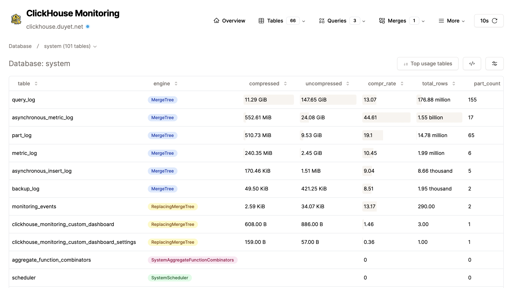
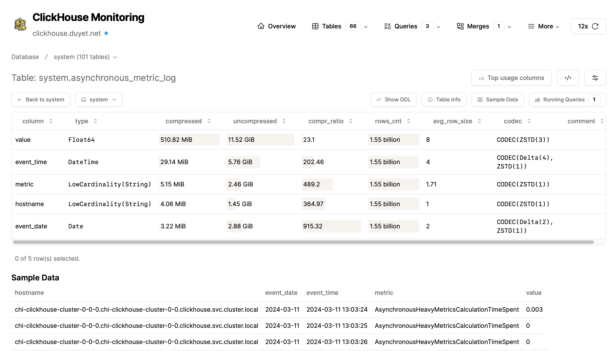
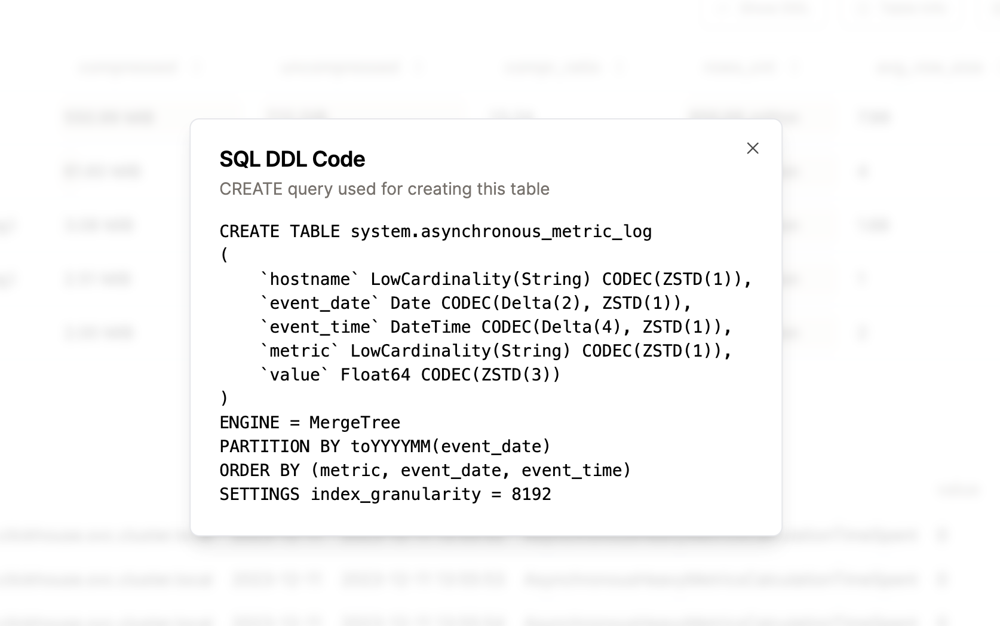
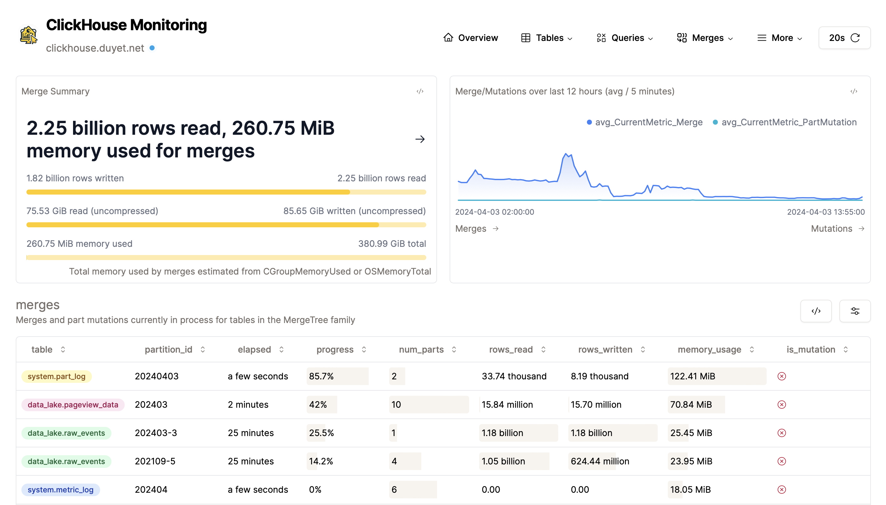
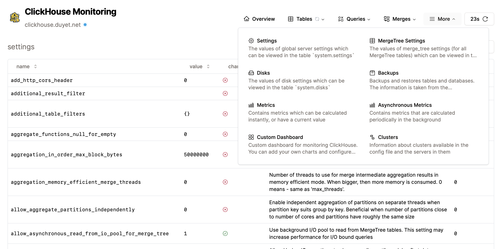

# ClickHouse Monitoring Dashboard

[](https://github.com/duyet/clickhouse-monitoring/actions/workflows/ci.yml)

The simple Next.js dashboard that relies on `system.*` tables to help monitor and provide an overview of your ClickHouse cluster.

Features:

- Query monitor: current queries, query history, query resources (memory, parts read, file_open, ...), most expensive queries, most used tables or columns, etc.
- Cluster monitor: total memory/CPU usage, distributed queue, global settings, mergetree settings, metrics, etc.
- Tables and parts information: size, row count, compression, part size, etc., at the column level detail.
- Useful tools: Zookeeper data exploration, query EXPLAIN, kill queries, etc.
- Visualization metric charts: queries and resource usage, number of merges/mutation, merge performance, query performance, etc.








## Getting Started

To get the project up and running on your local machine, follow these steps:

1. Clone the repository
2. Install dependencies with `npm install` or `yarn install`
3. Create a `.env.local` file by copying the `.env.example` file and filling in the required environment variables:
    - `CLICKHOUSE_HOST`: ClickHouse host, for example `http://localhost:8123`
    - `CLICKHOUSE_USER`: ClickHouse user with permission to query the `system` database.
    - `CLICKHOUSE_PASSWORD`: ClickHouse password for the specified user.
    - `CLICKHOUSE_TIMEOUT`: Timeout for ClickHouse queries in milliseconds. Default is `100000`.
    - `CLICKHOUSE_TZ`: ClickHouse server timezone. Default: `''`.
4. Run the development server with `npm run dev` or `yarn dev`
5. Open [http://localhost:3000](http://localhost:3000) in your browser to see the dashboard.

## Deployment

### 1. Vercel

For easy deployment, use the [Vercel Platform](https://vercel.com/new?utm_medium=default-template&filter=next.js&utm_source=create-next-app&utm_campaign=create-next-app-readme), created by the makers of Next.js. Refer to the [Next.js deployment documentation](https://nextjs.org/docs/deployment) for more details.

### 2. Docker

Using the latest image here: https://github.com/duyet/clickhouse-monitoring/pkgs/container/clickhouse-monitoring

```bash
docker run -it \
    -e CLICKHOUSE_HOST='http://localhost' \
    -e CLICKHOUSE_USER='default' \
    -e CLICKHOUSE_PASSWORD='' \
    -e CLICKHOUSE_TZ='Asia/Ho_Chi_Minh' \
    --name clickhouse-monitoring \
    ghcr.io/duyet/clickhouse-monitoring:main
```

### 3. Kubernetes Helm Chart

Using the latest helm chart here: https://github.com/duyet/charts/tree/master/clickhouse-monitoring

```bash
helm repo add duyet https://duyet.github.io/charts

cat <<EOF >> values.yaml
env:
  - name: CLICKHOUSE_HOST
    value: http://localhost:8123
  - name: CLICKHOUSE_USER
    value: default
  - name: CLICKHOUSE_PASSWORD
    value: ''
  - name: CLICKHOUSE_TZ
    value: 'Asia/Ho_Chi_Minh'
EOF

helm install -f values.yaml clickhouse-monitoring-release duyet/clickhouse-monitoring
```

#### Suggested role for "monitoring" user

```xml
# File: users.d/monitoring_role.xml
<clickhouse>
  <users>
    <monitoring>
      <!-- define password here -->
      <profile>default</profile>
      <networks><ip>::/0</ip></networks>
      <grants>
        <query>GRANT monitoring_role</query>
      </grants>
    </monitoring>
  </users>

  <roles>
    <monitoring_role>
      <grants>
        <query>REVOKE ALL ON *.*</query>
        <query>GRANT SELECT,SHOW,dictGet,REMOTE ON *.*</query>
        <query>GRANT SELECT,INSERT,ALTER,CREATE,DROP,TRUNCATE,OPTIMIZE,SHOW,dictGet ON system.*</query>
      </grants>
    </monitoring_role>
  </roles>
</clickhouse>
```

## Feedback and Contributions

Feedback and contributions are welcome! Feel free to open issues or submit pull requests.

## License

MIT. See [LICENSE](LICENSE) for more details.

---


